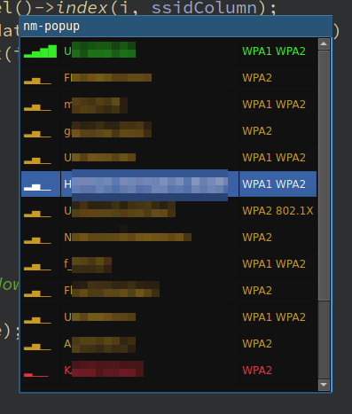

# About nm-popup

This is a small gui utility to make switching wifi networks a bit more comfortable.
It currently requires `nmcli` in your path to get a list of networks and connect to them.



## Building

- make sure these _dependencies_ are installed
  - qt >= 5.4
  - common building tools (make, gcc)
- execute the following _terminal commands_ in the root directory of the project:
  ```
  $ mkdir build
  $ cd build
  $ qmake ..
  $ make
  ```

